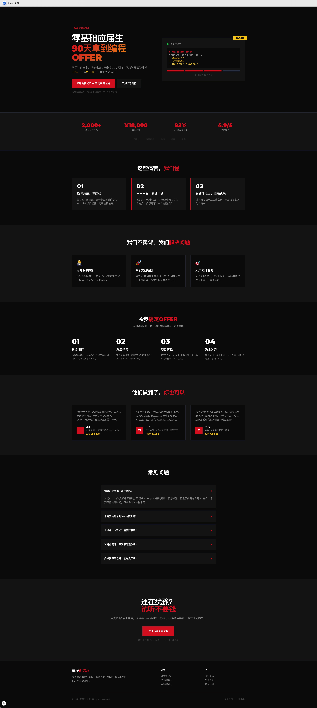
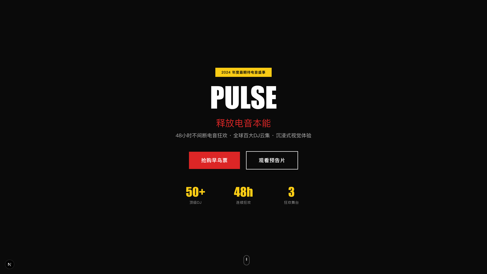
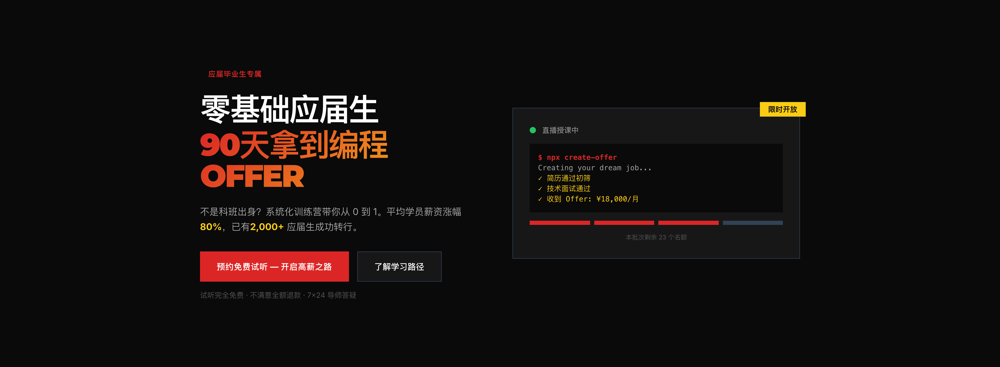
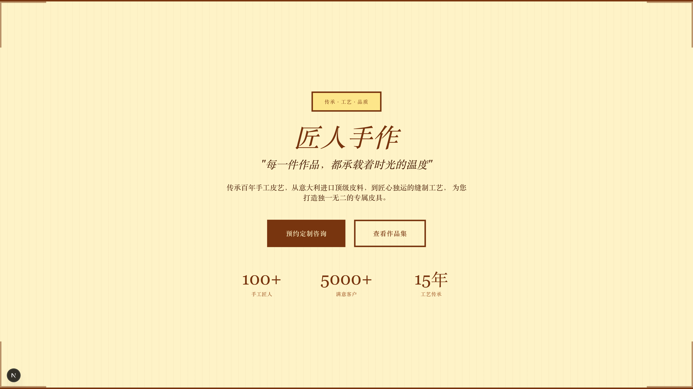
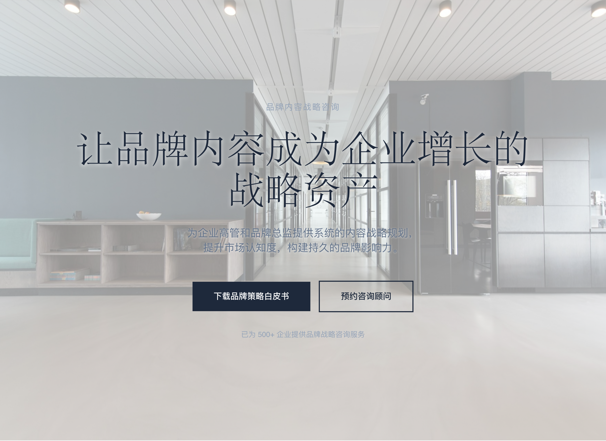
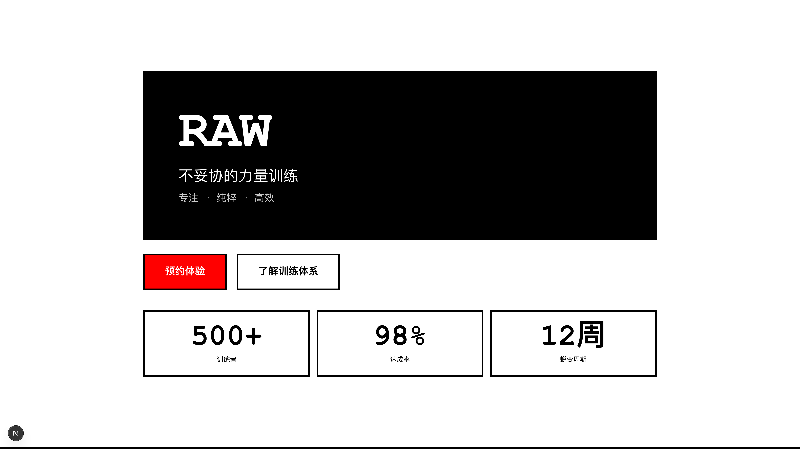

<div align="center">
  
  <br><br>
  
  <h1>Landing Page Skill</h1>
  <p><strong>End-to-End Landing Page Generation Agent Skill</strong></p>
  <p>
    <a href="README.md">简体中文</a> · <strong>English</strong>
  </p>
  <p>
    
    
    
    
    
  </p>
</div>

---

## Introduction

Landing Page Skill is an **agent-agnostic** Agent Skill that delivers end-to-end landing page generation, combining **copy strategy + visual design + code implementation** in a single workflow. Compatible with Claude Code, Codex CLI, Cursor, Gemini CLI, and 50+ other runtimes.

Existing solutions (bear2u, rampstackco, anthropics/frontend-design) each cover only one aspect, with limitations like tech stack lock-in, single-language support, and no quality detection. This Skill fills the gap by integrating the **DESIGNNAS 11-element conversion framework**, **7-segment copy architecture**, **6 aesthetic style templates**, and **5 anti-pattern detection rules**.

## Core Capabilities

| Module | Description |
|--------|-------------|
| **5-Phase Protocol** | Requirements → Strategy → Design System → Code Generation → Quality Validation |
| **DESIGNNAS 11 Elements** | Hero, Social Proof, Features, Benefits, How It Works, Testimonials, Pricing, FAQ, CTA, Scarcity, Footer |
| **7-Segment Copy Framework** | Hero → Problem → Solution → Benefits → Proof → Objection Handling → CTA |
| **6 Aesthetic Styles** | Minimalist / Bold / Vintage / Organic / Editorial / Brutalist |
| **Anti-Pattern Detector** | 5 MVP rules: Overused fonts, Template colors, Vague CTAs, Missing social proof, Weak headlines |
| **Tech Stack Adapter** | Next.js 14/15 + Tailwind CSS (App Router) |
| **Industry Templates** | SaaS product page, E-commerce product page |
| **Copy Formula Library** | Hero headline formulas, CTA pattern library, Objection handling strategies |
| **Cross-Runtime** | Compatible with Claude Code, Codex CLI, Cursor, Trae, and 50+ runtimes |

## Project Structure

```
landing-page-skill/
├── SKILL.md                          # Core instruction file (< 400 lines)
├── LICENSE                           # MIT License
├── README.md                         # Chinese version
├── README.en.md                      # This file
├── skills-lock.json                  # Skill registry lock file
├── assets/
│   ├── logo.svg                      # Brand logo
│   └── banner.svg                    # README banner
├── references/
│   ├── conversion-framework.md       # DESIGNNAS 11 elements + 7-segment copy
│   ├── design-system.md              # Typography/Color/Motion/Layout tokens
│   ├── aesthetic-styles.md           # 6 aesthetic style templates
│   ├── anti-patterns.md              # Anti-pattern detector: 5 rules
│   ├── runtime-compatibility.md      # Cross-runtime compatibility docs
│   ├── tech-adapters/
│   │   └── nextjs-tailwind.md        # Next.js + Tailwind adapter
│   ├── copy-formulas/
│   │   ├── hero-headlines.md         # Hero headline formula library
│   │   ├── cta-patterns.md           # CTA pattern library
│   │   └── objection-handling.md     # Objection handling strategies
│   └── page-templates/
│       ├── saas-product.md           # SaaS product page template
│       └── ecommerce.md              # E-commerce product page template
└── scripts/
    ├── quality_check.py              # Quality check script
    └── preview.sh                    # Local preview script
```

## Quick Start

```bash
# Install (requires Agent Skills runtime, e.g. Claude Code)
npx skills add peterfei/landing-page-skill
```

## Usage

The Skill auto-activates when users mention trigger keywords:

> landing page, 落地页, 产品页, 营销页, 主页设计, single page website, 着陆页

The Agent then executes the **5-Phase Protocol**:

1. **Phase 1: Requirements** — Product, audience, conversion goal, tech stack, brand style
2. **Phase 2: Strategy** — Load industry template, select aesthetic direction, plan copy structure
3. **Phase 3: Design System** — Generate Typography / Color / Motion / Layout tokens
4. **Phase 4: Code Generation** — Output production-grade Next.js + Tailwind components
5. **Phase 5: Quality Validation** — Conversion check + Anti-pattern detection + Technical audit

## Quality Check

```bash
python scripts/quality_check.py
```

Validates:
- All required files exist
- SKILL.md ≤ 400 lines
- Frontmatter format is valid
- All 5 anti-pattern rules are present

## Cross-Runtime Compatibility

This Skill is designed as **agent-agnostic** and compatible with:

| Runtime | Support |
|---------|---------|
| Claude Code | Native, recommended |
| Codex CLI | Compatible, direct load |
| Cursor | Compatible, `.cursorrules` or Composer |
| Trae | Compatible, direct load |
| OpenClaw | Compatible, skills.sh protocol |
| Other markdown-based skill runtimes | Compatible |

See `references/runtime-compatibility.md` for details.

## Applicability

**Applicable:** Single-page conversion landing pages (SaaS, e-commerce, consulting, courses)

**Not applicable:** Multi-page websites, backend integration, complex interactive apps, non-Web platforms

## Preview

> The following landing page was generated by this Skill in a single conversation turn (Zero to Coding Bootcamp — Bold style)

<div align="center">
  
</div>

### Aesthetic Styles Showcase

This Skill includes **6 built-in aesthetic style templates**, covering the complete design spectrum from minimalist to brutalist:

| Style | Features | Example Product | Preview |
|------|----------|-----------------|---------|
| **Minimalist** | White space, restrained colors, no decoration | FlowSync - Workflow Automation Platform |  |
| **Bold** | High contrast, bold typography, strong visual impact | PULSE - Immersive Electronic Music Festival |  |
| **Bold** | Zero-to-Coding Bootcamp | 90-Day Coding Career Bootcamp for Beginners |  |
| **Vintage** | Warm tones, decorative borders, classic fonts | Artisan Crafts - Handmade Leather Studio |  |
| **Organic** | Natural colors, rounded corners, soft gradients | GreenLife - Organic Food Subscription |  |
| **Editorial** | Magazine layout, serif fonts, high readability | InsightMedia - In-depth Business Insights |  |
| **Brutalist** | Thick borders, high contrast, raw aesthetics | RAW - Minimalist Strength Training |  |

## License

MIT License — see [LICENSE](LICENSE) for details.

<div align="center">
  <sub>Built for the Agent Skills ecosystem</sub>
</div>
