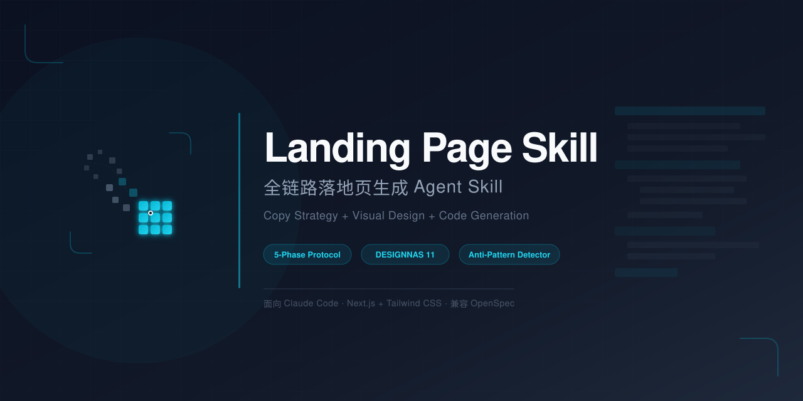
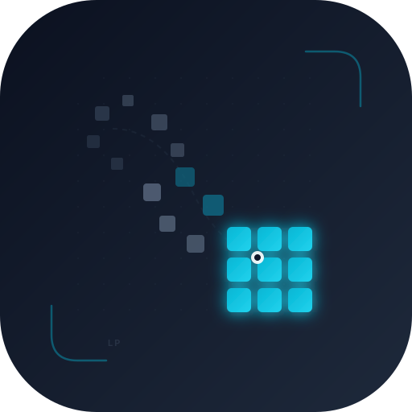

<div align="center">
  
  <br><br>
  
  <h1>Landing Page Skill</h1>
  <p><strong>全链路落地页生成 Agent Skill</strong></p>
  <p>
    <strong>简体中文</strong> · <a href="README.en.md">English</a>
  </p>
  <p>
    
    
    
    
  </p>
</div>

---

## 简介

Landing Page Skill 是一个面向 Claude Code 的 Agent Skill，实现**文案策略 + 视觉设计 + 代码实现**三位一体的全链路落地页生成能力。

市场上已有的竞品（bear2u、rampstackco、anthropics/frontend-design）各自只覆盖单一环节，存在技术栈锁定、语言单一、无质量检测等明显缺陷。本 Skill 通过融合 **DESIGNNAS 11 元素转化框架**、**7 段式文案架构**、**6 种美学风格模板** 和 **5 项反模式主动检测**，填补了这一空白。

## 核心能力

| 模块 | 说明 |
|------|------|
| **5 阶段协议** | 需求采集 → 策略规划 → 设计系统 → 代码生成 → 质量验证 |
| **DESIGNNAS 11 元素** | Hero、社会证明、Features、Benefits、How It Works、Testimonials、Pricing、FAQ、CTA、稀缺性、Footer |
| **7 段式文案框架** | Hero → 痛点 → 解决方案 → 利益 → 证据 → 异议处理 → CTA |
| **6 种美学风格** | 极简 / 大胆 / 复古 / 有机 / 编辑 / 粗野 |
| **反模式检测器** | 5 项 MVP 检测规则：泛滥字体、模板化配色、CTA 模糊、缺少社会证明、Hero 标题无力 |
| **技术栈适配器** | Next.js 14/15 + Tailwind CSS（App Router） |
| **行业模板** | SaaS 产品页、电商产品页 |
| **文案公式库** | Hero 标题公式、CTA 模式库、异议处理策略 |

## 项目结构

```
landing-page-skill/
├── SKILL.md                          # 核心指令文件（< 400 行）
├── LICENSE                           # MIT 许可证
├── README.md                         # 本文件
├── README.en.md                      # 英文版
├── assets/
│   ├── logo.svg                      # 品牌 Logo
│   └── banner.svg                    # README 横幅
├── references/
│   ├── conversion-framework.md       # 转化框架：11 元素 + 7 段式文案
│   ├── design-system.md              # 设计系统：Typography/Color/Motion/Layout Token
│   ├── aesthetic-styles.md           # 美学风格：6 种风格模板
│   ├── anti-patterns.md              # 反模式检测器：5 项规则
│   ├── tech-adapters/
│   │   └── nextjs-tailwind.md        # Next.js + Tailwind 适配器
│   ├── copy-formulas/
│   │   ├── hero-headlines.md         # Hero 标题公式库
│   │   ├── cta-patterns.md           # CTA 模式库
│   │   └── objection-handling.md     # 异议处理策略
│   └── page-templates/
│       ├── saas-product.md           # SaaS 产品页模板
│       └── ecommerce.md              # 电商产品页模板
└── scripts/
    ├── quality_check.py              # 质量检查脚本
    └── preview.sh                    # 本地预览脚本
```

## 使用方法

在 Claude Code 中，当用户提到以下触发词时 Skill 自动激活：

> landing page、落地页、产品页、营销页、主页设计、single page website、着陆页

Agent 将按 **5 阶段协议** 自动执行：

1. **Phase 1: 需求采集** — 确认产品、受众、转化目标、技术栈、品牌风格
2. **Phase 2: 策略规划** — 加载行业模板、选择美学方向、规划文案结构
3. **Phase 3: 设计系统** — 生成 Typography / Color / Motion / Layout Token
4. **Phase 4: 代码生成** — 输出 Next.js + Tailwind 生产级组件代码
5. **Phase 5: 质量验证** — 转化检查 + 反模式检测 + 技术审计

## 质量检查

```bash
python scripts/quality_check.py
```

验证项目完整性：
- 所有必需文件存在性
- SKILL.md 行数 ≤ 400
- Frontmatter 格式正确
- 5 项反模式规则完整

## 适用场景

**适用：** 单页转化型落地页（SaaS、电商单品、咨询服务、课程）

**不适用：** 多页网站、后端集成、复杂交互应用、非 Web 平台

## 许可证

MIT License — 详见 [LICENSE](LICENSE)。

<div align="center">
  <sub>为 Agent Skills 生态而生</sub>
</div>
